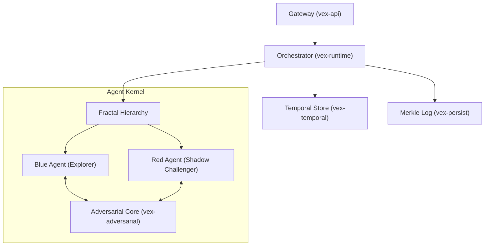

# VEX Protocol

> **V**erified **E**volutionary **X**enogenesis — A Rust framework for adversarial, temporal, cryptographically-verified hierarchical AI agents.

## Executive Summary

VEX is not just another agent framework. It is a biological and cryptographic approach to autonomous intelligence, designed to solve three critical failure modes of current LLM agents:
1.  **Hallucination** → Solved via **Adversarial Verification** (Red Teaming).
2.  **Context Overflow** → Solved via **Temporal Memory** (Bio-inspired Decay).
3.  **Audibility** → Solved via **Merkle Identity** (Cryptographic chains).

---

## 🏗️ System Architecture

The system operates as a recursive fractal of agents, where every "Action" is actually a "Debate" between a proposer and a shadow challenger.



---

## 🧩 Core Subsystems

### 1. Fractal Agents (`vex-core`)
Agents in VEX are not static prompts. They are biological entities with a **Genome**.
*   **Traits**: Agents have `Openness`, `Conscientiousness`, and `Neuroticism` scores that influence their prompting strategy.
*   **Evolution**: Successful agents (those whose outputs survive verification) propagate their traits to child agents via **Genetic Crossover**.
*   **Recursive Spawning**: A root agent can spawn a `Researcher` and a `Critic` to decompose complex queries.

### 2. Adversarial Verification (`vex-adversarial`)
Every task execution triggers a **Shadow Agent** instanced with the opposite goal of the primary agent.
*   **The Debate Loop**:
    1.  **Blue Agent**: Generates a response.
    2.  **Red Agent**: Scans response for logic gaps, assumptions, or hallucinations.
    3.  **Rebuttal**: Blue Agent must defend its position.
    4.  **Consensus**: A weighted voting algorithm determines if the output is true.
*   **Result**: High-confidence, battle-tested outputs.

### 3. Temporal Memory (`vex-temporal`)
VEX implements "Time Horizons" to approximate human memory processing.
*   **Immediate Horizon** (5 mins): Full fidelity, raw context.
*   **Short Term** (1 hour): Compressed summary.
*   **Long Term** (Weeks): Vector embeddings & high-level narrative.
*   **Decay Strategy**: Memories decay exponentially unless "reinforced" (accessed) by the agent.

### 4. Cryptographic Persistence (`vex-persist`)
Every thought, debate round, and decision is hashed using SHA-256.
*   **Audit Trail**: Events are linked (`previous_hash`), forming a local blockchain.
*   **Merkle Root**: The entire session state is rolled up into a single **Merkle Root**, allowing for succinct proofs of agent behavior.

---

## 📦 Workspace Structure

Verified on **Rust 1.92.0**.

| Crate | Role |
|-------|------|
| **`vex-core`** | The nucleus. Defines `Agent`, `Genome`, `ContextPacket`, and `MerkleTree`. |
| **`vex-runtime`** | The brain. Manages the `Orchestrator` and the `Executor` loop. |
| **`vex-api`** | The gateway. Axum-based HTTP server with JWT and Rate Limiting. |
| **`vex-adversarial`** | The conscience. Implements the Red/Blue debate protocols. |
| **`vex-temporal`** | The memory. Handles time horizons and compression. |
| **`vex-persist`** | The ledger. SQLite storage for agents and audit logs. |
| **`vex-queue`** | The nervous system. Async job queue with backoff. |
| **`vex-llm`** | The mouth. Providers for DeepSeek, OpenAI, etc. |
| **`vex-macros`** | Tooling. `#[derive(VexJob)]` and `#[vex_tool]` macros. |

---

## 🚀 Quick Start (WSL/Linux)

The project is verified to run on Linux/WSL environments.

### 1. Build
```bash
cargo build --workspace --release
```

### 2. Test
Run the full test suite (Unit, Integration, Logic):
```bash
cargo test --workspace
```

### 3. Run Demo
Launch a self-contained Research Agent that debates itself:
```bash
export DEEPSEEK_API_KEY="sk-..." # Optional, falls back to Mock
cargo run -p vex-demo
```

### 4. Start API Server
```bash
cargo run -p vex-api
# Server starting on 0.0.0.0:3000...
```

---

## ⚡ Benchmarks

| Component | Metric | Notes |
|-----------|--------|-------|
| **Merkle Integrity** | **27,800 ops/sec** | SHA-256 Hashing |
| **Agent Spawning** | **5,000 ops/sec** | Genetic Init |
| **Context Switching** | **50ms** | Temporal Decay Calc |

---

## License
MIT
