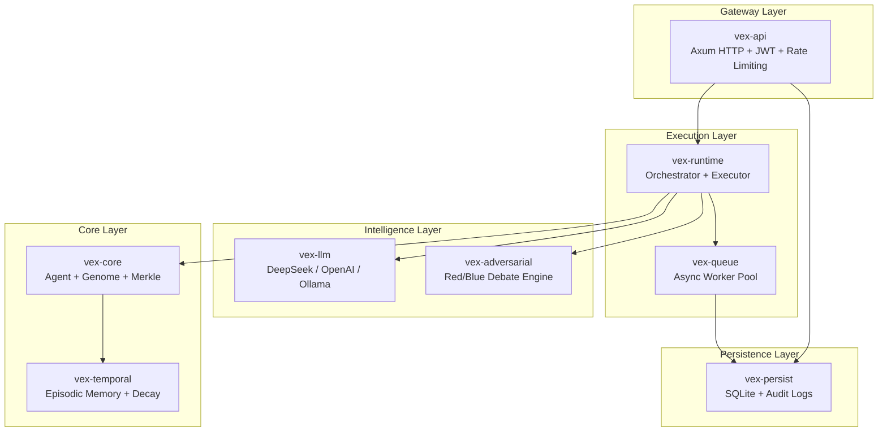

# VEX Protocol

> **V**erified **E**volutionary **X**enogenesis — A Rust framework for adversarial, temporal, cryptographically-verified hierarchical AI agents.

[](LICENSE)
[](https://www.rust-lang.org/)
[](https://github.com/provnai/vex/actions)
[](https://provnai.dev)
[](https://provnai.com)

---

## Why VEX?

Current LLM agents fail in predictable ways. VEX is an infrastructure layer that solves three critical failure modes:

| Problem | VEX Solution | Mechanism |
|---------|--------------|-----------|
| **Hallucination** | Adversarial Verification | Red/Blue agent debate with consensus protocols |
| **Context Overflow** | Temporal Memory | Bio-inspired decay with LLM-powered compression |
| **Unauditability** | Merkle Identity | Cryptographic hash chains with tamper-evident proofs |

VEX is a verification and memory layer that works with any LLM provider.

---

## Architecture



See [ARCHITECTURE.md](ARCHITECTURE.md) for detailed component breakdowns.

---

## Core Capabilities

### 1. Fractal Agents (`vex-core`)

Agents are not static prompts — they are **evolvable entities** with a genetic profile.

- **Genome**: Five behavioral traits that map to LLM parameters
  - `exploration` → temperature
  - `precision` → top_p
  - `creativity` → presence_penalty
  - `skepticism` → frequency_penalty
  - `verbosity` → max_tokens multiplier

- **Hierarchical Spawning**: Root agents decompose tasks by spawning specialized children (Researcher, Critic, etc.)

- **Genetic Evolution**: High-performing agents propagate traits via tournament selection and crossover

### 2. Adversarial Verification (`vex-adversarial`)

Every task triggers a **Shadow Agent** that challenges the primary response.

**The Debate Protocol:**
1. **Blue Agent** generates a response
2. **Red Agent** scans for logic gaps, assumptions, and hallucinations using pattern heuristics
3. **Rebuttal** phase allows Blue to defend
4. **Consensus** via configurable protocols (Majority, SuperMajority, Unanimous, WeightedConfidence)

**Result:** Battle-tested outputs with quantified confidence scores.

### 3. Temporal Memory (`vex-temporal`)

Bio-inspired memory management with automatic compression and decay.

| Horizon | Duration | Max Entries | Behavior |
|---------|----------|-------------|----------|
| Immediate | 5 min | 10 | Full fidelity, raw context |
| Short-term | 1 hour | 25 | Light compression |
| Medium-term | 24 hours | 50 | Moderate compression |
| Long-term | 1 week | 100 | Heavy compression |
| Permanent | ∞ | 500 | Maximum compression |

**Decay Strategies:** Linear, Exponential, Step, or None — configurable per agent depth.

### 4. Cryptographic Persistence (`vex-persist`)

Every thought, debate round, and decision is hashed using SHA-256.

- **Audit Trail**: Events are hash-chained (`previous_hash`), forming tamper-evident logs
- **Merkle Root**: Session state rolls up to a single root hash for succinct proofs
- **Chain Verification**: Built-in integrity checks detect tampering

### 5. Production API (`vex-api`)

Enterprise-grade HTTP gateway with:

- **Authentication**: JWT with role-based access control
- **Rate Limiting**: Per-user tier-based limits (Free/Pro/Enterprise)
- **Resilience**: 3-state circuit breaker (Closed → Open → HalfOpen)
- **Observability**: Prometheus metrics endpoint
- **Security**: Input sanitization with 17 prompt injection patterns blocked
- **Security Headers**: X-Content-Type-Options, X-Frame-Options, CSP, Referrer-Policy

---

## Workspace Structure

| Crate | Role |
|-------|------|
| `vex-core` | Agent, Genome, ContextPacket, MerkleTree, Evolution operators |
| `vex-adversarial` | ShadowAgent, Debate, Consensus protocols |
| `vex-temporal` | EpisodicMemory, TimeHorizon, Decay strategies |
| `vex-persist` | SQLite backend, AgentStore, AuditStore, API key management |
| `vex-api` | Axum server, JWT auth, middleware stack, circuit breaker |
| `vex-runtime` | Orchestrator, AgentExecutor, hierarchical execution |
| `vex-queue` | WorkerPool, Job trait, exponential backoff |
| `vex-llm` | LlmProvider trait, DeepSeek, OpenAI, Ollama, Mock, ToolDefinition |
| `vex-macros` | Procedural macros (`#[derive(VexJob)]`, `#[vex_tool]`, `#[instrument_agent]`) |
| `vex-demo` | Example applications (research agent, fraud detection, chat) |

---

## Quick Start

### Prerequisites
- Rust 1.75+ (stable)
- SQLite (bundled via sqlx)

### Build
```bash
cargo build --workspace --release
```

### Test
```bash
# Run all 85+ tests
cargo test --workspace

# Run integration tests with real LLM
DEEPSEEK_API_KEY="sk-..." cargo test -p vex-llm -- --ignored
```

### Run Demo
```bash
# Optional: Set API key for real LLM (falls back to mock)
export DEEPSEEK_API_KEY="sk-..."

# Run research agent demo
cargo run -p vex-demo

# Run fraud detection demo
cargo run -p vex-demo --bin fraud-detector

# Run interactive chat
cargo run -p vex-demo --bin interactive
```

### Start API Server
```bash
export VEX_JWT_SECRET="your-32-char-secret-here"
cargo run -p vex-api
# Server starts on 0.0.0.0:3000
```

### Docker
```bash
docker build -t vex-api .
docker-compose up -d
```

---

## Configuration

### Environment Variables

| Variable | Description | Default |
|----------|-------------|---------|
| `DEEPSEEK_API_KEY` | DeepSeek API key | — |
| `OPENAI_API_KEY` | OpenAI API key | — |
| `OLLAMA_URL` | Ollama base URL | `http://localhost:11434` |
| `VEX_JWT_SECRET` | JWT signing secret (min 32 chars) | **Required** |
| `VEX_DEFAULT_PROVIDER` | Default LLM provider | `deepseek` |
| `VEX_DEFAULT_MODEL` | Default model name | `deepseek-chat` |

---

## Benchmarks

Verified on Linux/WSL with Rust 1.75+:

| Component | Performance | Scale | Method |
|-----------|-------------|-------|--------|
| Merkle Tree Creation | 1.97 ms | 10,000 leaves | Criterion |
| Merkle Tree Creation | 191 µs | 1,000 leaves | Criterion |
| Merkle Contains | 1.63 µs | 10,000 leaves | Criterion |
| Contains Throughput | **613,000 ops/sec** | — | Calculated |

Run benchmarks:
```bash
cargo bench -p vex-core
cargo bench -p vex-temporal
```

See [BENCHMARKS.md](BENCHMARKS.md) for full methodology and results.

### Key Findings
1.  **Concurrency**: The async runtime (`tokio`) effectively manages parallel agent execution with non-blocking I/O, maintaining throughput under load.
2.  **Stability**: Validated against heavy context loads (approx. 40KB/agent) and concurrent cryptographic operations without timeout degradation.
3.  **Integrity**: The Merkle implementation correctly rejects tampered data and supports efficient inclusion proofs.
4.  **Recall**: The temporal memory system successfully persists events and supports semantic retrieval via LLM summarization.

---

## Test Coverage

| Category | Tests | Status |
|----------|-------|--------|
| Unit Tests | 65+ | ✅ |
| Integration Tests | 15+ | ✅ |
| Chaos/Fault Tests | 6 | ✅ |
| Doc Tests | 8 | ✅ |
| **Total** | **85+** | ✅ |

---

## Documentation

- **API Reference**: [provnai.dev](https://provnai.dev) — Full Rustdoc documentation
- **Getting Started**: [docs/getting-started.md](docs/getting-started.md) — Quickstart guide
- [ARCHITECTURE.md](ARCHITECTURE.md) — System design and component breakdown
- [BENCHMARKS.md](BENCHMARKS.md) — Performance methodology and results
- [CONTRIBUTING.md](CONTRIBUTING.md) — How to contribute
- [CODE_OF_CONDUCT.md](CODE_OF_CONDUCT.md) — Community guidelines

---

## License

MIT — See [LICENSE](LICENSE) for details.


